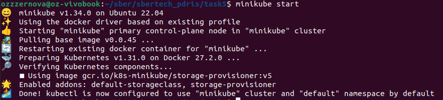
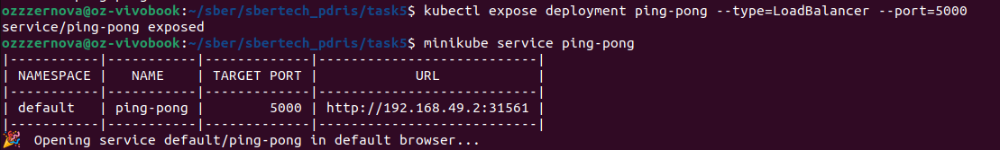
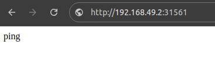

## Kubernetes

~~0. страдания с тем что snap плохо поставил minikube~~
1. Стартуем `minikube start`

2. Поды через `kubectl`
 ```
kubectl create -f kube/postgres.yaml
kubectl create -f kube/deployment.yaml
 ```
3. Создаем сервис
 
4. Лицезреем успех
 
5. Напоследок посмотрим, что запущено
 
